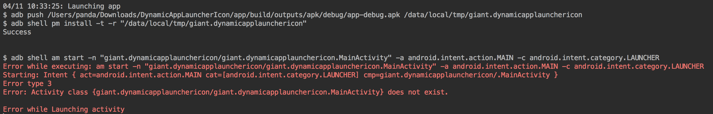

# DynamicAppLauncherIcon

本工程介绍的是如何实现动态的修改app在launcher上的icon和文案。

## 项目的运行效果

请自行下载运行下~~

## 知识准备

### activity-alias标签

它其实就是某个activity的别名，它主要有如下的作用：

* 可以在手机上建立一个快捷的启动item，直接打开目标activity
* 就是可以实现动态的切换图标

> 标签介绍

基本语法的定义：

```xml
<activity-alias android:enabled=["true" | "false"]
                android:exported=["true" | "false"]
                android:icon="drawable resource"
                android:label="string resource"
                android:name="string"
                android:permission="string"
                android:targetActivity="string" >
    . . .
</activity-alias>
```

* android:enabled：标记目标activity是否可以通过别名实例化，默认为true。注意application也有enable属性，只用当它们同时为true时，activity-alias的enable才生效。
* android:enabled：标记目标activity是否可以被其他应用调起，true的话就是可以调起。默认值根据activity-alias是否包含intent-filter元素决定，如果有的话，则默认为true；没有的话则为false。
* android:icon
* android:label
 * 这2个参数就是可以对别名activity使用不容的icon和label，同时也是动态替换的关键
* android:name：可以是任意的字符串，仅作为唯一的标识而已
* android:permission：该属性指明了通过别名声明调起目标Activity所必需的权限
* android:targetActivity：实际需要启动的activity

> 实例

```java
<activity-alias
            android:icon="@drawable/one"
            android:label="one"
            android:name="MainActivityAlias1"
            android:targetActivity=".MainActivity">
            <intent-filter>
                <action android:name="android.intent.action.MAIN" />
                <category android:name="android.intent.category.LAUNCHER" />
            </intent-filter>
        </activity-alias>

        <activity-alias
            android:icon="@drawable/two"
            android:label="two"
            android:name="MainActivityAlias2"
            android:targetActivity=".MainActivity">
            <intent-filter>
                <action android:name="android.intent.action.MAIN" />
                <category android:name="android.intent.category.LAUNCHER" />
            </intent-filter>
        </activity-alias>

        <activity-alias
            android:icon="@drawable/three"
            android:label="three"
            android:name="MainActivityAlias3"
            android:targetActivity=".MainActivity">
            <intent-filter>
                <action android:name="android.intent.action.MAIN" />
                <category android:name="android.intent.category.LAUNCHER" />
            </intent-filter>
        </activity-alias>
```

### PM.setComponentEnabledSetting

这个的作用其实就是管理component的，主要是对component的打开和关闭等。

这个有什么使用场景呢：

* 动态切换图标
* 隐藏app图标
* 禁止各种receiver等（比如创建了一个broadcastReceiver广播监听器，用来想监听第一次开机启动后获得系统的许多相关信息，并保存在文件中，这样以后每次开机启动就不需要再去启动该服务了，也就是说如果没有把receiver关闭掉，就算是不做数据处理，但程序却还一直在后台运行会消耗电量和内存，这时候就需要把这个receiver给关闭掉。 ）

> 可用的状态值

* COMPONENT_ENABLED_STATE_DISABLED：component不可用
* COMPONENT_ENABLED_STATE_ENABLED：component启用
* COMPONENT_ENABLED_STATE_DISABLED_USER：用户操作禁用
* COMPONENT_ENABLED_STATE_DISABLED_UNTIL_USED：

> 使用示例

```java
private void enableComponent(ComponentName componentName) {
    mPm.setComponentEnabledSetting(componentName,
            PackageManager.COMPONENT_ENABLED_STATE_ENABLED,
            PackageManager.DONT_KILL_APP);
}

private void disableComponent(ComponentName componentName) {
    mPm.setComponentEnabledSetting(componentName,
            PackageManager.COMPONENT_ENABLED_STATE_DISABLED,
            PackageManager.DONT_KILL_APP);
}
```

### 问题&优化

修改后，切换需要稍等一段时间，怎样才能立即看到变化呢？

> 只要通过Intent重启Launcher即可

```java
Intent intent = new Intent(Intent.ACTION_MAIN);
intent.addCategory(Intent.CATEGORY_HOME);
intent.addCategory(Intent.CATEGORY_DEFAULT);
List<ResolveInfo> resolves = pm.queryIntentActivities(intent, 0);
for (ResolveInfo res : resolves) {
    if (res.activityInfo != null) {
        ActivityManager am = (ActivityManager) getSystemService(ACTIVITY_SERVICE);
        am.killBackgroundProcesses(res.activityInfo.packageName);
    }
}
```

这个的原理就是杀掉Launcher的进程来等待重启，但是测试下来没啥卵用~~

> 问题1：

activity-alias里的资源只能是本地的，没有办法通过java代码来进行设置，无法配合服务器下发的方式进行更灵活的更改。

> 问题2：

这个其实也不算是问题，就是在切换了alias后，再直接通过AS运行就直接报错，如下：



但是app其实已经安装上去了，只是在启动的时候报错，原因是已经切到alisa上，而AS安装还是启动缺省的activity。
